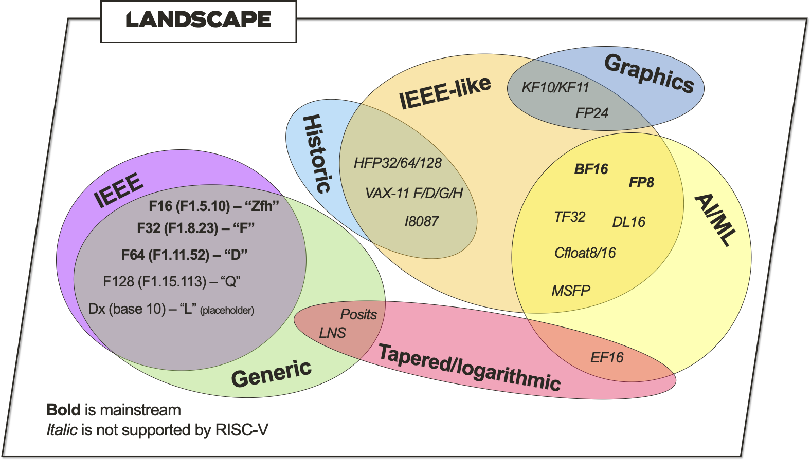

# FP SIG - Gap Analysis [Draft]
There are a large number of floating point formats. The FP SIG is tasked with exploring the landscape and identifying gaps in the current support for floating point by RISC-V.

This analysis primarily focusses on support for the number format itself, but also includes the ecosystem, such as software support and verification support, and details such as rounding modes and subnormal support.

We have adopted the strategy of considering all known number formats, but only identify number formats that have become or are becoming mainstream as gaps. The non-mainstream formats are monitored for relevant developments.

All information in this analysis has been discussed and reviewed by the FP SIG members.

## Current floating point support
Note that all current extensions, except for the BF16 ones, are IEEE 754-2008 compliant.

Ratified extensions currently support the following floating point formats:
- F - Standard Extension for Single-Precision Floating-Point
- D - Standard Extension for Double-Precision Floating-Point
- Q - Standard Extension for Quad-Precision Floating-Point
- Zfh - Standard Extensions for Half-Precision Floating-Point
- Zfhmin - Standard Extension for Minimal Half-Precision Floating-Point Support, data transfer and conversion instructions only
- Zfinx, Zdinx, Zhinx, Zhinxmin - Standard Extensions for Floating-Point in Integer Registers
- Zfa - Standard Extension for Additional Floating-Point Instructions
- V, Zve64f, Zve64d - Vector extension support for floating-point
- Zfbfmin - BF16 extension for data-transfer and conversion instructions only
- Zvfbmin, Zvbfwma - Vector extension support for BF16, data-transfer and conversion, or widening multiply-add only

Draft extensions currently support the following floating point formats:
- Zvfh, Zvfhmin - Vector extension support for half-precision floating point

Placeholders for future extensions supporting floating point formats:
- L - Standard Extension for Decimal Floating-Point

## Floating point catalogue
Machine learning has introduced a myriad of new (floating point) number formats. These in addition to the many historic number formats in existence.

The FP SIG has created a catalogue of known formats, extracting commonalities and identifying differences, which can be found [here](https://docs.google.com/spreadsheets/d/1PQukUGth9KFmhqLjsZ-22Lpnnf1ZnF8Sw0GxHzg6C2s). This document is expected to be continuously updated.

### Classification
From the FP catalogue, we've grouped number formats by type and use case. This landscape is shown in the following figure:

#### Types
The majority are IEEE 754 compliant or nearly compliant IEEE-like, for example not supporting subnormals or limited exceptional values. Those formats consist of a fixed-size logarithmic part (exponent) and a fixed-size linear part (fraction). Then there are tapered floating point formats aimed at increasing accuracy in the range near 1 and which have a variable width exponent and fraction, and specialised formats such as the LNS (logarithmic number system) format which has no linear part.

Non-IEEE number formats are currently still considered a research topic not requiring mainstream support.

#### Use cases
In terms of usage we roughly identify the following categories: generic, historic, graphics, and AI/ML.

The historic formats pre-date the IEEE 754 standardisation and therefore have only niche use cases. Ratified support by RISC-V is thus not necessary.

Graphics formats are usually supported on GPUs which currently is not a common use case for RISC-V, and hence doesn't require mainstream support.

AI/ML formats have blossomed recently in the quickly developing field. These formats therefore have an increased interest from the community and are tracked more closely. Two formats are notable; BF16 is supported by most ISAs, such as Intel AVX-512, ARMv8.2, or Power ISA v3.1, and FP8 is being standardised by an IEEE working group (P3109).

### Mainstream
IEEE single precision and double precision are clearly the most ubiquitous floating point formats in use, and already supported together with half precision and quad precision. These are considered mainstream formats.

Decimal floating point support seems mostly used in financial applications and the FP SIG is not aware of current interest to ratify the L extension, nor is it typically supported by other ISAs (except IBM's Power). The FP SIG will therefore not progress the extension at this time.

BF16 is of interest to the wider community, and already has ratified support for use as a storage format and in widening multiply-add vector instruction. It is therefore considered a mainstream format.

FP8 is on track to be a ratified IEEE standard and therefore also considered a mainstream format.

Note: There are more than one FP8 format being considered for ratification. There are currently gathered under the name "binary8" formats [P3109 working group interim report](https://github.com/P3109/Public/blob/main/Shared%20Reports/P3109%20WG%20Interim%20report.pdf). 

## Ecosystem
It has been highlighted that programming languages have little support for floating point numbers other than single and double precision.

It has been highlighted that floating point is poorly supported in the Architecture Compatibility Suite and as a formal reference model.

## Gaps
The FP SIG has highlighted the following gaps in floating point support for RISC-V:
- BF16 as an arithmetic format - interest has been raised several times and software has initial support, e.g. StableHLO/XLA and CUDA. There is no consensus on subnormal or rounding mode support for BF16.
- FP8 - it is expected that IEEE standardisation will make this a widely used format.
- Floating point software support, and verification support needs further investigation.

The FP SIG has considered the following as potential gaps that will be monitored:
- Decimal floating point support for financial applications
- The scientific computing community has expressed initial interest in even higher precision floating point such as octal precision and variable precision

## Recommendation
The current recommendation is:
- to set up a task group to ratify an extension supporting BF16 as an arithmetic format support,
- to closely track IEEE FP8 developments, and
- to resolve the ecosystem support questions.
